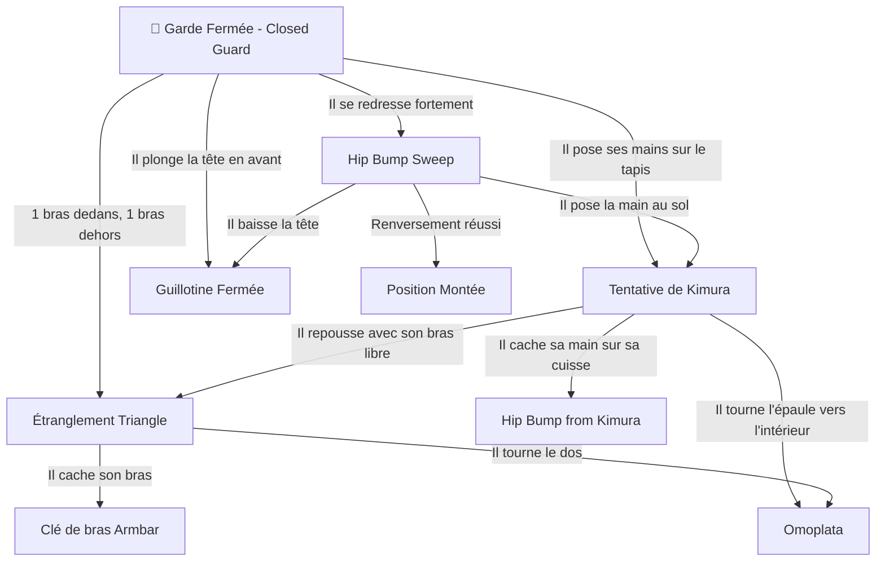

# 🥋 BJJ Nexus — Tactical GPS & Action-Reaction Engine

<div align="center">

[](https://nextjs.org/)
[](https://react.dev/)
[](https://www.typescriptlang.org/)
[](https://tailwindcss.com/)
[](https://developer.mozilla.org/en-US/docs/Web/Progressive_web_apps)
[](https://derkitoo.github.io/nexus/)

**Une application web mobile native façon Apple iOS dédiée au Jiu-Jitsu Brésilien (JJB/BJJ) et Grappling, conçue comme un véritable GPS tactique dynamique.**

[🌐 **Accéder à l'application en direct (Live Demo)**](https://derkitoo.github.io/nexus/)

</div>

---

## 📱 Aperçu de l'Expérience Mobile (Apple-Style)

BJJ Nexus réinvente l'apprentissage des arts martiaux de préhension. Contrairement aux catalogues passifs de techniques, l'application fonctionne selon le principe fondamental du combat au sol : **l'arbre de décision Action $\rightarrow$ Réaction $\rightarrow$ Contre**.



---

## ✨ Fonctionnalités Majeures

### 1. 🧭 Navigation GPS Tactique & Arbre Décisionnel
- **Cartographie dynamique :** Sélection de positions souches (Garde fermée, De La Riva, Papillon, Ashi Garami, Demi-Garde).
- **Réactions adverses en temps réel :** Identifiez instantanément les réactions typiques de l'adversaire et les enchaînements correspondants (balayage, soumission, passage de garde).
- **Radar & Dépannage tactique :** Conseils de biomécanique et corrections de posture pour chaque technique.

### 2. 🎥 Démonstrations Vidéo Intégrées & Certifiées
- **100% vidéos JJB vérifiées :** Démonstrations de classe mondiale (Gordon Ryan, Marcelo Garcia, Bernardo Faria, Chewjitsu, Evolve MMA).
- **Lecteur optimisé :** Mode double bascule (Vidéo démonstrative $\leftrightarrow$ Visualiseur vectoriel Radar).
- **Lien direct YouTube 1-Tap :** Accès direct pour révision complète.

### 3. 🎙️ Copilote Vocal & Synthèse Vocale
- Guidage audio complet via la **Web Speech API** pour s'entraîner les mains libres sur les tatamis.
- Annonce vocale des réactions tactiques et des timings de soumission.

### 4. ⏱️ Chronomètre de Sparring & Rounds
- Timer d'intervalles HIIT / Rounds de combat avec retours audio (bips de transition et gong de fin).
- Ratios de rounds et repos entièrement personnalisables.

### 5. 🥋 Passeport de Grades & Journal de Sparring
- **Suivi de progression :** Arbre de compétences de la ceinture Blanche à la ceinture Noire.
- **Journal de combat :** Enregistrement des rounds, soumissions réussies, taps subis et notes d'entraînement sauvegardées localement.

### 6. 📜 Règlement Officiel IBJJF Intégré
- Barème officiel des points (Passage de garde, Montée, Prise de dos, Genou sur l'estomac).
- Liste des techniques autorisées et prohibées par ceinture.

---

## 🥋 Systèmes Tactiques Inclus

1. **Système Garde Fermée (Closed Guard) :** Enchaînements classiques Kimura $\rightarrow$ Hip Bump $\rightarrow$ Triangle $\rightarrow$ Clé de bras $\rightarrow$ Omoplata.
2. **Système De La Riva & Berimbolo :** L'art de la garde ouverte moderne, fauchages Tripod, inversions Berimbolo et Crab Ride vers le dos.
3. **Système Garde Papillon & Guillotine :** Dynamique offensive sans kimono (No-Gi), Hook Sweeps, Arm Drags et Guillotines High-Elbow façon Marcelo Garcia.
4. **Système Ashi Garami (Leg Locks) :** Contrôles des membres inférieurs, Straight Ankle Lock et Outside Heel Hook.
5. **Système Demi-Garde & Underhook :** Remontée Dogfight, fauchages et prises de dos.

---

## 🛠️ Stack Technique

- **Framework :** [Next.js 15](https://nextjs.org/) (App Router, React 19)
- **Langage :** [TypeScript](https://www.typescriptlang.org/) (Typage strict de l'arbre décisionnel)
- **Design & Styles :** [Tailwind CSS v4](https://tailwindcss.com/) (Design System Apple iOS, OLED `#000000`, flous acryliques `ios-glass`)
- **PWA & Offline :** Service Worker avec cache local (`public/sw.js`, `manifest.json`)
- **Audio & Haptique :** Web Audio API (oscillateurs temps réel) & Web Speech API
- **Icônes :** [Lucide React](https://lucide.dev/)
- **Déploiement :** GitHub Pages via GitHub Actions automatisé

---

## 🚀 Installation Locale

```bash
# Cloner le dépôt
git clone https://github.com/Derkitoo/nexus.git
cd nexus

# Installer les dépendances
npm install

# Démarrer le serveur de développement
npm run dev

# Ouvrir dans votre navigateur
http://localhost:3005
```

---

## 📦 Déploiement GitHub Pages

Le déploiement est entièrement automatisé via le workflow [`.github/workflows/deploy.yml`](.github/workflows/deploy.yml).

Dès qu'un commit est poussé sur la branche `main`, GitHub Actions compile l'application Next.js en mode export statique et la déploie sur :
**`https://derkitoo.github.io/nexus/`**

> **Note :** Dans les paramètres de votre dépôt GitHub (`Settings` > `Pages`), assurez-vous que la source est définie sur **GitHub Actions**.

---

## 📄 Licence

Ce projet est sous licence MIT. Libre d'utilisation pour tous les pratiquants, académies et passionnés de Jiu-Jitsu Brésilien et Grappling.
